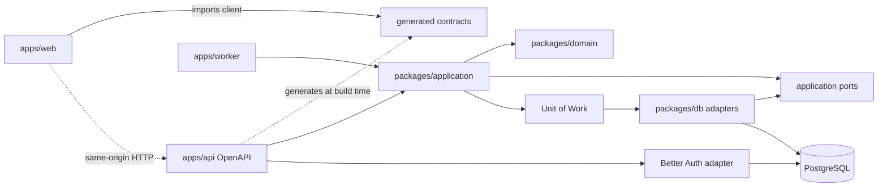
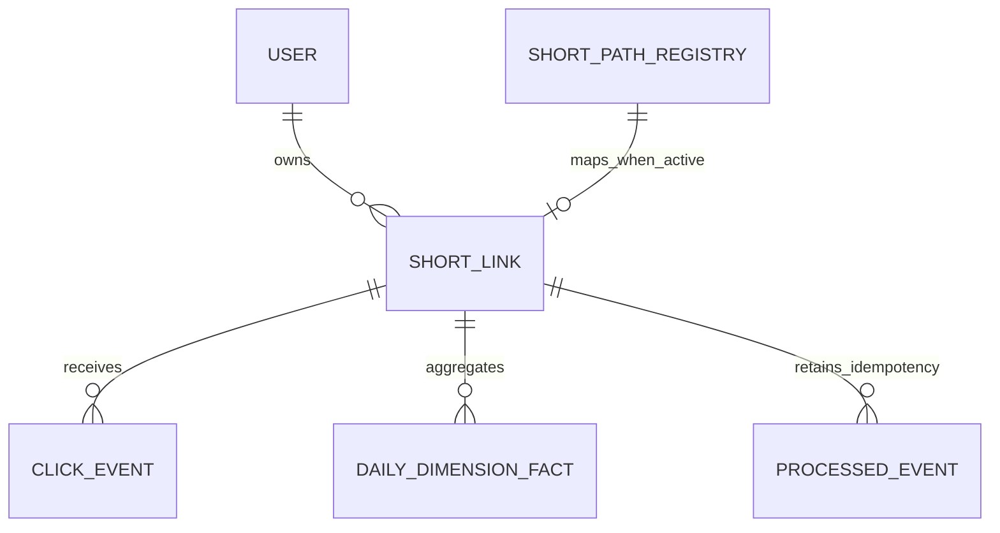

# Architecture Spine — URL Shortener System

## Design Paradigm

**Same-origin React SPA + modular NestJS backend + asynchronous PostgreSQL worker.**

- `apps/web`: presentation and browser state; depends only on generated API client.
- `apps/api`: HTTP composition root, auth mount, redirect and application modules.
- `apps/worker`: background processing composition root; imports application/domain modules, never HTTP controllers.
- `packages/application`: shared use cases, orchestration ports and Unit of Work; imported by API and worker.
- `packages/domain`: entities, value objects and pure rules; no framework, database or browser imports.
- `packages/db`: Drizzle schema, transaction-scoped repositories and migrations; implements application ports.
- `packages/contracts`: generated OpenAPI client/types; generated output, never hand-edited.



## Invariants & Rules

### AD-1 — Module ownership and dependency direction [ADOPTED]

- **Binds:** all
- **Prevents:** business rules duplicated across controllers, workers and React routes.
- **Rule:** HTTP/controllers and worker entrypoints call `packages/application` use cases; application depends on pure domain plus application ports; adapters implement ports. `packages/domain` cannot import NestJS, React, Drizzle or Better Auth. Workspace manifests and ESLint boundary rules enforce the graph; architecture tests fail when domain imports frameworks or worker imports controllers. API OpenAPI generation must leave `packages/contracts` clean in CI.

### AD-2 — One public origin with reserved route precedence [ADOPTED]

- **Binds:** FR-1–FR-10, NFR-4–NFR-10
- **Prevents:** CORS/cookie divergence and collisions between root short paths and application routes.
- **Rule:** NestJS serves the React build and owns a fixed reserved registry (`/api/*`, `/api/auth/*`, health endpoints, immutable static prefixes). Exact one-segment root paths are checked against `short_path_registry` before any SPA fallback. CI/deploy compares every new root application route against active+tombstoned registry values and blocks collision; existing short paths always win. Multi-segment nonreserved browser routes may fall back to SPA after short-path evaluation.

### AD-3 — PostgreSQL owns the global short-path namespace [ADOPTED]

- **Binds:** FR-4, FR-5, FR-8, FR-10, NFR-9, NFR-16
- **Prevents:** concurrent Code/Alias collision, illegal active+tombstoned state, case drift and deleted-path reuse.
- **Rule:** One `short_path_registry` table owns every path forever: canonical `short_path NOT NULL UNIQUE`, state `active|tombstoned`, and nullable link reference with DB CHECK enforcing `active` has exactly one link while `tombstoned` has none. DB CHECK enforces ASCII lowercase grammar and length; app uses one `ShortPath` value object that percent-decodes once, rejects Unicode/noncanonical segments and normalizes before allocation. Alias and generated Code use the same allocator/reserved registry. Generated Code has a fixed alphabet/length selected at bootstrap and bounded collision retry. Delete atomically transitions registry state and link status; only SQLSTATE `23505` for the named namespace constraint maps to collision.

### AD-4 — Redirect truth comes from PostgreSQL [ADOPTED]

- **Binds:** FR-7, FR-8, FR-10, NFR-1, NFR-16
- **Prevents:** stale destinations after edit/delete and two sources of redirect truth.
- **Rule:** MVP performs indexed PostgreSQL lookup through a bounded pool; no redirect cache. Active link returns HTTP 302 with `Cache-Control: no-store`; missing/deleted/tombstoned path returns 404. Introduce cache only after the prescribed production-like benchmark misses NFR-1 and an invalidation protocol is adopted in a new AD.

### AD-5 — A counted click is durable before redirect response [ADOPTED]

- **Binds:** FR-10, FR-11, NFR-1, NFR-3, NFR-15, SM-8
- **Prevents:** queue-only loss, best-effort analytics and redirect waiting for aggregation.
- **Rule:** For a recognized human GET, API derives bounded local dimensions, inserts one core Click Event in PostgreSQL, then returns redirect. Recognized bot/link-preview requests redirect without event. Enrichment failure writes `unknown`; raw IP is never persisted. If event commit fails after a bounded retry inside the latency budget, return HTTP 503 and do not redirect. Database lookup failure/pool exhaustion also returns 503; aggregation never runs on the request path.

### AD-6 — Event identity and replay are idempotent [ADOPTED]

- **Binds:** FR-11, FR-13–FR-16, SM-8
- **Prevents:** retry double-counting and incompatible event handlers.
- **Rule:** API assigns an immutable request/event UUID. Click Event stores event-time UTC timestamp and UTM snapshot. Worker transaction first executes `INSERT INTO processed_event(event_id, short_link_id, processed_at) ... ON CONFLICT DO NOTHING RETURNING event_id`; only the transaction that receives a row may UPSERT the daily fact and mark the Click Event processed. `processed_event.event_id` is globally UNIQUE, has no FK/cascade to raw Click Event, and is retained at least as long as aggregate facts. A conflict commits no aggregate change; replay is a no-op.

### AD-7 — PostgreSQL rows are the durable work queue [ADOPTED]

- **Binds:** FR-11–FR-16, NFR-3, NFR-12
- **Prevents:** Redis/BullMQ becoming a second source of truth and missed notifications losing work.
- **Rule:** Legal event states are `pending|leased|processed|dead_letter`. Claim transaction selects `pending` rows with `available_at <= db_now()` or expired `leased` rows, `FOR UPDATE SKIP LOCKED`; atomically sets `leased`, a fresh lease token, `lease_until` from DB clock, and increments attempts. Completion/retry/dead-letter updates require `state='leased' AND lease_token=:token`. Failure before attempt five sets `pending` plus DB-clock `available_at` exponential backoff; attempt five sets `dead_letter`. A dedicated LISTEN connection is optional wake optimization: commit LISTEN, scan after registration, re-LISTEN/rescan after reconnect, retain polling. Dead letters replay only before 30 days, then delete with reconciliation-loss metric/alert.

### AD-8 — Daily dimensional facts own retained analytics [ADOPTED]

- **Binds:** FR-13–FR-16, NFR-11–NFR-14, SM-3, SM-4, SM-8
- **Prevents:** incompatible rollups, opaque dimension blobs and indefinite retention of sensitive high-cardinality values.
- **Rule:** Worker UPSERTs typed, non-null aggregate columns keyed by `(utc_day, short_link_id, referrer_host, country, city, device, browser, utm_source, utm_medium, utm_campaign)` with canonical `unknown` and a composite UNIQUE constraint. Referrer retains normalized origin/host only—never path/query/fragment/userinfo. UTM values are trimmed, length-bounded, control-character rejected and percent-decoded once; device/browser use bounded enums; GeoIP supplies normalized country/city. Dashboard/Compare read facts, not raw events. Raw/dead-letter events are deleted at 30 days; retained facts contain no raw IP or full URL query.

### AD-9 — Authentication has one owner [ADOPTED]

- **Binds:** FR-1–FR-3, NFR-4–NFR-10
- **Prevents:** Nest guards, custom sessions and Better Auth each defining identity differently.
- **Rule:** Better Auth owns users, sessions, email verification and Google linking; its generated schema/migrations are imported into Drizzle and reviewed in the same migration chain. Better Auth user IDs are canonical strings; application `ActorId` and every owner FK use the same string representation—C4 must not assume UUID users. API/worker run ESM. Bootstrap Nest with `bodyParser: false`, mount official Express 5 `toNodeHandler(auth)` at `/api/auth/*splat` before Nest JSON/urlencoded parsers, then initialize remaining Nest routes. Production cookies use `HttpOnly`, `Secure`, `SameSite=Lax`; the one public origin is validated through `Origin`/`Sec-Fetch-Site` for every unsafe method, and generated client sends same-origin credentials. Google validates `state`/OIDC `nonce`; linking requires verified email plus fresh re-authentication and never auto-merges by email claim. Password policy/hash and generic errors are pinned/tested. An integration spike must prove JSON auth request, cookie, unsafe-method CSRF acceptance/rejection and Nest session resolution. No community wrapper or second session store.

### AD-10 — Security and rate limits are enforced at trust boundaries [ADOPTED]

- **Binds:** FR-1–FR-5, FR-9, NFR-4–NFR-10
- **Prevents:** unauthenticated abuse, account enumeration, unsafe mutations and inconsistent throttling across replicas.
- **Rule:** Login and link creation use PostgreSQL-backed atomic fixed-window counters keyed by account/IP policy, return HTTP 429 with `Retry-After`, and emit throttle metrics. Destination scheme, reserved paths, alias grammar and UTM limits are validated in application/domain and DB constraints. Operator-configured denylist can disable a malicious link while preserving tombstone/404. Trusted proxy configuration is explicit; no client-supplied forwarding header is trusted by default.

### AD-11 — UTM composition and email delivery have one owner [ADOPTED]

- **Binds:** FR-1, FR-12, NFR-12
- **Prevents:** browser/server URL divergence and unverifiable verification-email flows.
- **Rule:** `packages/application` owns pure URL composition: trim outer whitespace, preserve casing, replace duplicate UTM keys, preserve unrelated query/fragment, percent-encode and return preview; web consumes the API result. Better Auth owns token state; an email adapter port sends verification mail outside DB transactions with cooldown/rate limit, secret-free logs, bounded retry and recoverable unverified state.

### AD-12 — Idempotent mutations reconcile ambiguous retries [ADOPTED]

- **Binds:** FR-4–FR-9, UX mutation flows
- **Prevents:** duplicate links after network timeout or unknown response.
- **Rule:** Create-link accepts an owner-scoped idempotency key; a unique `(owner_id, idempotency_key)` stores result and replay returns the same resource. Edit/delete are idempotent by link ID and expected version. Timeout recovery queries by key before retry.

### AD-13 — Ownership is enforced inside every use case [ADOPTED]

- **Binds:** FR-3, FR-6–FR-8, FR-12–FR-16
- **Prevents:** controller-only authorization and cross-account analytics leakage.
- **Rule:** Every authenticated query/mutation accepts actor ID and scopes repository operations by owner. Compare accepts only 2–5 links whose owner matches the actor. Public redirect exposes destination only through redirect response, never metadata.

### AD-14 — NestJS owns runtime and API contracts [ADOPTED]

- **Binds:** FR-1–FR-16
- **Prevents:** handwritten frontend/backend DTO drift.
- **Rule:** NestJS DTO validation is authoritative and emits OpenAPI. `packages/contracts` is generated in CI and consumed by React Router Data Mode loaders/actions. Generated files are not manually edited; OpenAPI diff is reviewed with API changes.

### AD-15 — Mutations are transactional at aggregate boundaries [ADOPTED]

- **Binds:** FR-4–FR-9, FR-11–FR-16
- **Prevents:** partial link/tombstone state and aggregate/event divergence.
- **Rule:** Link create/edit/delete and namespace changes use one PostgreSQL transaction per use case through an application `UnitOfWork` port that supplies transaction-scoped repositories. Worker commits aggregate UPSERT, processed-event uniqueness marker and lease-token-guarded event state atomically; only the current lease token may commit. External email/OAuth effects are not held inside database transactions.

### AD-16 — Operational evidence is part of the build [ADOPTED]

- **Binds:** NFR-1–NFR-3, NFR-15, SM-9
- **Prevents:** an architecture that cannot prove latency, freshness or failure isolation.
- **Rule:** All processes emit JSON logs with request/event correlation IDs. API exposes liveness/readiness; worker exposes heartbeat through database/metrics. Record redirect and dashboard latency histograms, event age/queue lag, retries, dead-letter count, DB pool saturation and lost-click metric. Alerts cover SLO breach, dead letters and worker freshness >60 seconds.

### AD-17 — Deployment is same-region, independently restartable [ADOPTED]

- **Binds:** all operational behavior
- **Prevents:** cross-region database latency and worker lifecycle tied to HTTP deploys.
- **Rule:** Render Singapore hosts separate web/API and worker services plus managed PostgreSQL in the same region/private network. Web/API serves SPA and HTTP. Worker handles events/retention only. Both handle SIGTERM, finish bounded in-flight work and close pools before exit; migrations run once before traffic cutover.

## Consistency Conventions

| Concern | Convention |
| --- | --- |
| Names | TypeScript symbols `camelCase`/`PascalCase`; PostgreSQL `snake_case`; files kebab-case; events past tense, e.g. `click-recorded`. |
| IDs | UUID for domain/event IDs; Better Auth user/Actor/owner FK is canonical string; short path is a distinct normalized string, never used as DB primary key. |
| Dates | UTC `timestamptz` at boundaries; API ISO 8601; aggregate day is UTC date. |
| Missing dimensions | Persist and expose canonical `unknown`, never `NULL` in aggregate key dimensions. |
| API errors | RFC 9457-style problem object: `type`, `title`, `status`, `detail`, `instance`, optional `code` and `fieldErrors`. |
| Mutation | Application use case is the only mutation entry; no controller/React/worker direct table writes. |
| Config | Environment validated at process startup; secrets only through Render secret env; no fallback production secrets. |
| Logging | Structured JSON; sanitize proxy/access logs too—no raw IP, password, token, cookie, full destination query or email verification secret. |
| Data classification | Auth/session secrets: secret; raw Click Event: restricted/30-day; retained facts: bounded aggregate; links/account metadata: confidential. |
| Index baseline | Registry unique canonical path; Click Event pending index on `(status, available_at, lease_until)` plus retention index on `occurred_at`; facts composite UNIQUE key plus `(short_link_id, utc_day)` query index. Compare fetches all 2–5 links in one query, never N+1. |
| Migrations | Drizzle-generated SQL reviewed and applied forward-only; destructive changes require expand/migrate/contract. |

## Stack

Seed verified on 2026-07-19; exact versions are pinned at implementation start and then owned by lockfile/code.

| Name | Version |
| --- | --- |
| Node.js | >=22.22.0, exact lock/toolchain pin at bootstrap |
| TypeScript | 5.x, exact implementation pin at bootstrap |
| React / React DOM | 19.2.7 |
| React Router Data Mode | 8.2.0 |
| Vite | 8.1.5, validate with starter |
| NestJS aligned packages | 11.1.28 |
| Express adapter | Nest 11 aligned Express 5 |
| Drizzle ORM | 0.45.2 |
| Drizzle Kit | 0.31.10 |
| Better Auth aligned packages | 1.6.23 |
| PostgreSQL | supported 18.x; provider-managed current minor |
| Apache ECharts | 6.1.0 |
| Vitest | 4.1.10 |
| Playwright | 1.61.1 |
| Render | Singapore region |

## Structural Seed

```text
apps/
  web/                 # React Router SPA; generated client only
  api/                 # Nest HTTP composition root and Better Auth mount
  worker/              # event aggregation, retry, retention
packages/
  application/         # shared use cases, ports and Unit of Work
  domain/              # entities, value objects and pure rules
  db/                  # Drizzle schema, transaction-scoped repositories, migrations
  contracts/           # generated OpenAPI client/types
  observability/       # logger, metrics and correlation primitives
```



## Capability → Architecture Map

| Capability / Area | Lives in | Governed by |
| --- | --- | --- |
| Auth and account lifecycle | Better Auth mount, auth adapter, web auth routes | AD-2, AD-9, AD-10, AD-14, AD-18 |
| Link CRUD and namespace | application link use cases, namespace repository | AD-1, AD-3, AD-10, AD-12, AD-15 |
| Link creation rate limit | application rate-limit port, PostgreSQL counter adapter | AD-10, AD-15 |
| Public redirect | redirect controller/use case | AD-2, AD-4, AD-5 |
| Click capture | redirect use case, click repository | AD-5, AD-6, AD-15 |
| Async aggregation | worker, event repository, fact repository | AD-6, AD-7, AD-8, AD-15 |
| UTM composition | application URL composer, generated API contract | AD-11, AD-14 |
| Email verification delivery | Better Auth token state, email adapter port | AD-11, AD-14 |
| Dashboard and Compare Links | analytics query module, React data routes | AD-8, AD-10, AD-14 |
| Operations and deployment | observability package, Render services | AD-16, AD-17, AD-19 |

### AD-18 — Authenticated mutations share one CSRF protocol [ADOPTED]

- **Binds:** NFR-4–NFR-7, all unsafe API methods
- **Prevents:** frontend/API choosing incompatible CSRF protections.
- **Rule:** Same-origin API accepts unsafe browser requests only when `Origin` exactly equals the configured public origin and `Sec-Fetch-Site` is `same-origin`; requests with missing, opaque or mismatched headers return HTTP 403 without mutation. Generated browser client always sends session credentials and never uses a CSRF token fallback. Non-browser/internal callers are outside the public API contract until a separate authenticated protocol is adopted.

### AD-19 — Architecture evidence is reproducible [ADOPTED]

- **Binds:** implementation bootstrap, CI, review gate
- **Prevents:** version drift and unverified framework integration.
- **Rule:** CI runs the Better Auth/Nest bootstrap integration test, architecture boundary test, OpenAPI generation diff, migration lint, namespace concurrency test and declared load benchmark. Lockfile pins Node >=22.22, React/React DOM 19.2.7, React Router 8.2.0 and all adapter versions; Windows 10 local Playwright is not a supported acceptance environment—use supported CI/Linux, WSL or Windows 11.

## Operational Envelope

| Concern | MVP contract |
| --- | --- |
| Redirect benchmark | 100 rps, 20 concurrent connections, 10 minutes; p95 ≤200 ms. |
| Dashboard benchmark | 100,000 facts/events in 30-day range, 20 concurrent requests after warm-up; p95 ≤2 s. Longer/custom ranges are best-effort. |
| DB connections | API and worker have separate bounded pools; configured total must stay below provider limit with migration/admin reserve. Pool acquire and statement timeouts are mandatory. |
| Worker | Bounded batch/concurrency, lease longer than max batch duration, polling interval configured below 60-second freshness budget; backlog applies backpressure rather than unbounded in-memory buffering. |
| Degraded API | Liveness ignores dependencies; readiness fails when PostgreSQL unavailable. Redirect lookup/event durability failure returns 503. |
| Retention | Singleton leased UTC job deletes raw/dead-letter events in chunks; metric `oldest_raw_event_age` alerts before exceeding 30 days. |
| Deployment | Migrations take advisory lock and are backward-compatible for one deploy; migration failure blocks cutover; API/worker check schema compatibility before readiness. |
| Backup/restore | Enable managed automated backup/PITR supported by selected Render plan; record accepted RPO/RTO at bootstrap and complete one restore drill before production marketing use. |
| Enrichment | Local bot/GeoIP/UA adapters use pinned/versioned data, bounded lookup time and explicit trusted-proxy chain; missing data maps to `unknown`. |

## Deferred

- Redis redirect cache: only after NFR-1 benchmark fails; requires a new cache consistency AD.
- BullMQ/external broker: only when PostgreSQL queue contention or queue features become measured constraints.
- Raw-event partitioning: add when 30-day deletion/VACUUM is measurably expensive.
- Multi-region and self-managed HA: revisit before external SLA or regional expansion; MVP backup/PITR and restore drill remain mandatory in Operational Envelope.
- Custom domains, public API, workspace/RBAC, billing and realtime analytics: outside MVP per PRD.
- Exact TypeScript/Express patch pins: select at implementation bootstrap within the bound runtime compatibility set and record in lockfile.
