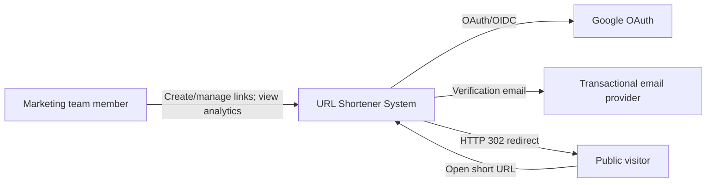
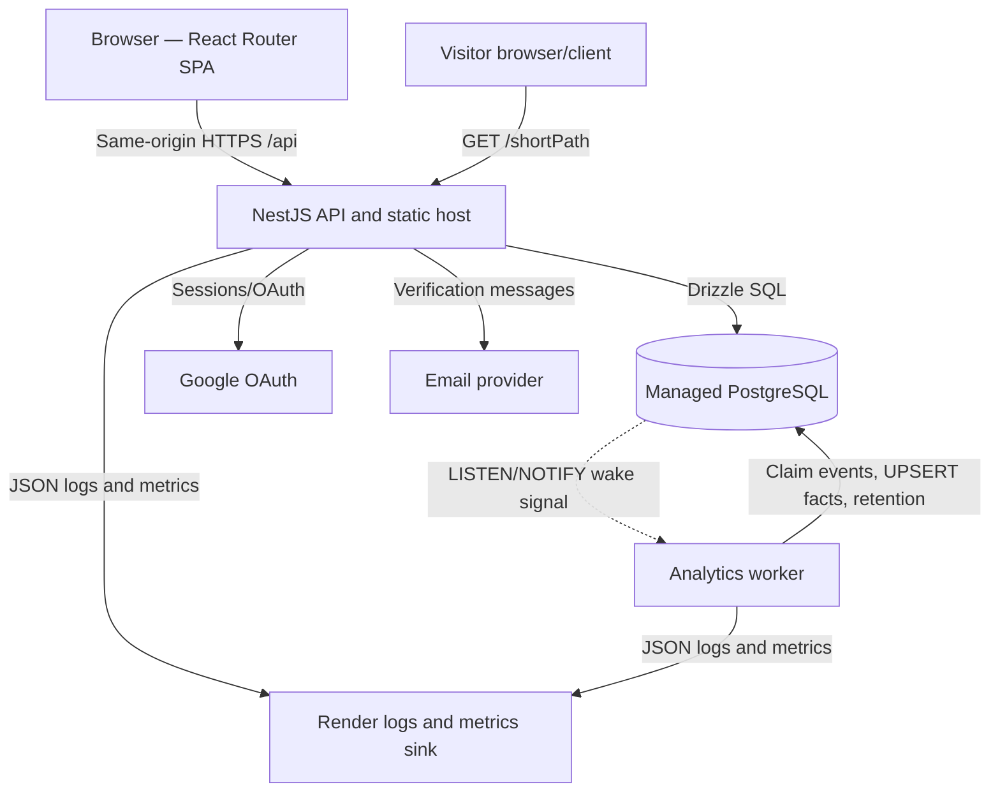
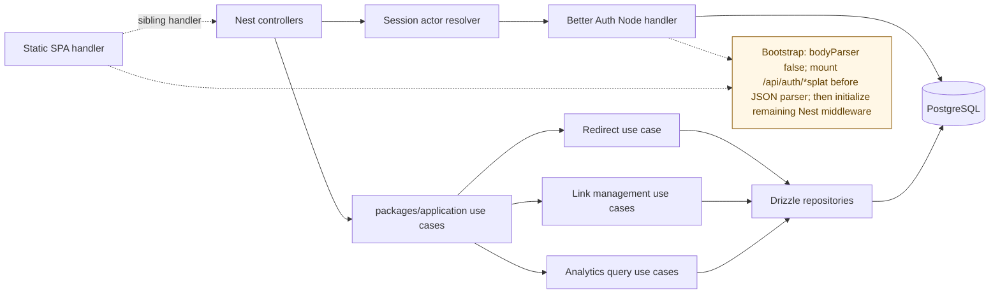
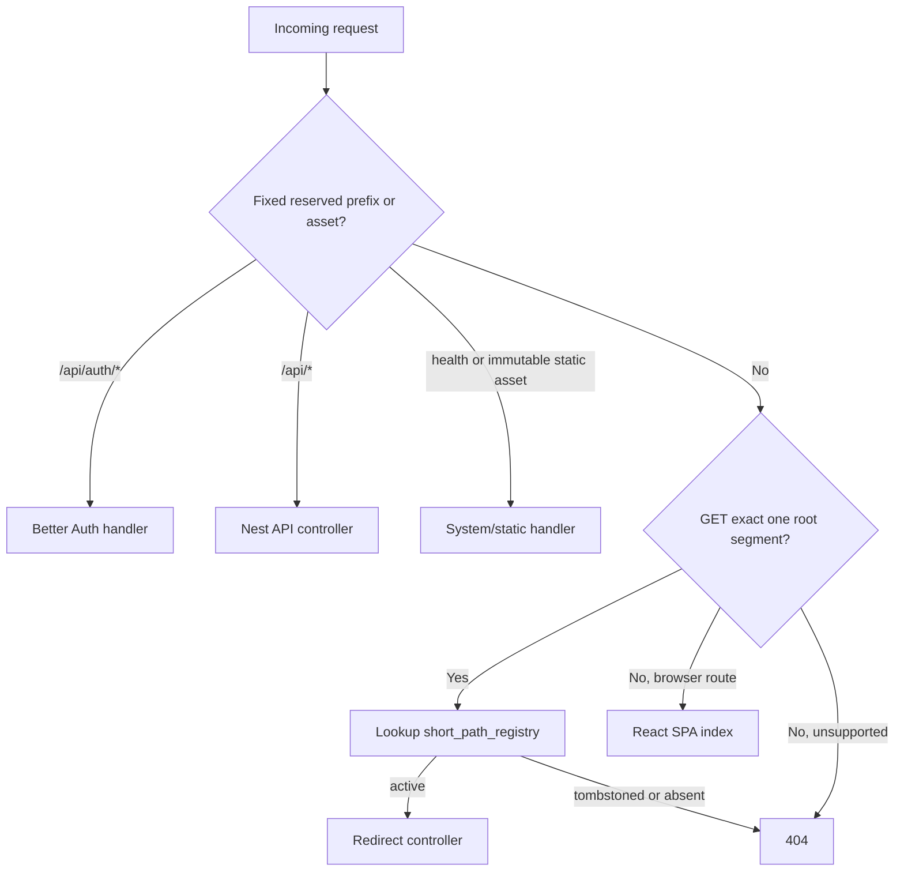
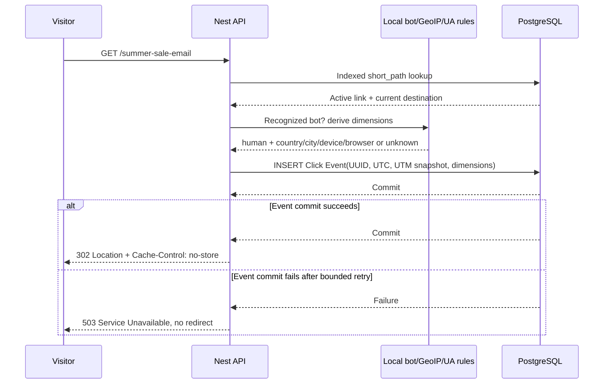
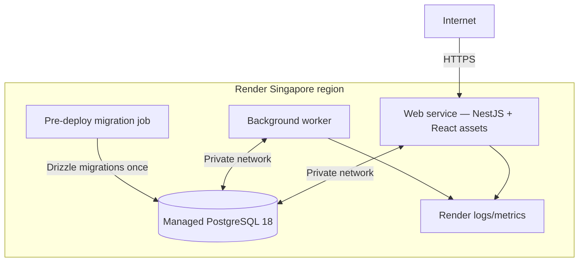
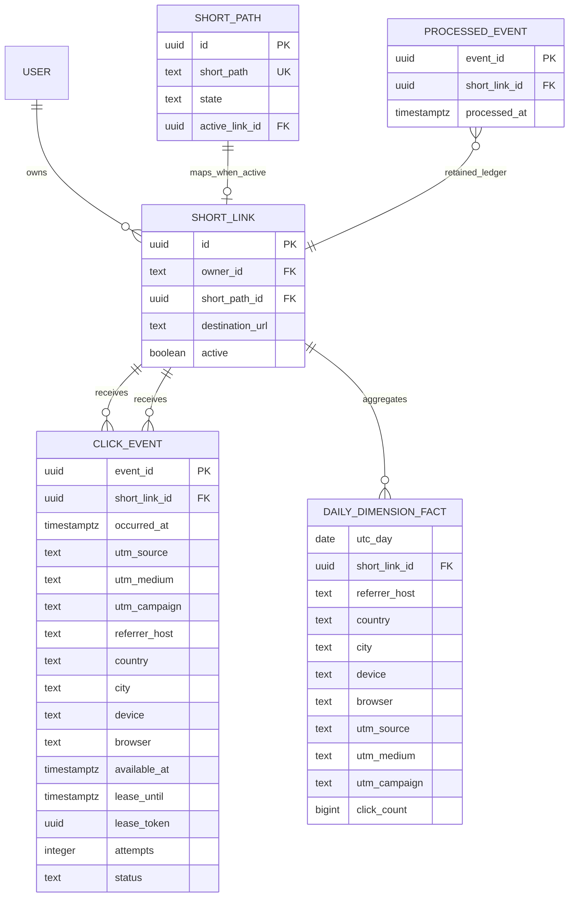

# URL Shortener System — C4 Views

`ARCHITECTURE-SPINE.md` thắng khi có xung đột. Các sơ đồ này phục vụ học system design và thảo luận implementation.

## 1. System Context



## 2. Container View



## 3. API Component View



Route precedence inside the API process:



## 4. Redirect and Capture Sequence



Failure rules:

- Link missing/deleted/tombstoned: 404, no external redirect.
- Recognized bot/link preview: 302, no Click Event.
- Local enrichment failure: write `unknown`, continue.
- PostgreSQL lookup/pool/event commit failure: 503, no external redirect.

## 5. Worker and Aggregation Sequence

```mermaid
sequenceDiagram
    participant P as PostgreSQL
    participant W as Analytics worker
    participant M as Metrics/alerts

    P-->>W: NOTIFY event id (wake hint)
    loop Poll after wake or timeout
        W->>P: Claim pending rows FOR UPDATE SKIP LOCKED + lease
        P-->>W: Event batch
        W->>P: Transaction: INSERT processed UUID ON CONFLICT DO NOTHING RETURNING
        alt marker acquired and lease token current
            W->>P: UPSERT daily fact + mark processed
            P-->>W: Commit
        else marker already exists
            W->>P: Mark raw row processed without aggregate change
        else transient failure before attempt 5
            W->>P: Schedule retry with DB-clock available_at + backoff
        else attempt 5 exhausted
            W->>P: Mark dead-letter; replay allowed only before 30-day expiry
            W->>M: Alert dead-letter
        else raw/dead-letter reaches 30 days
            W->>P: Delete raw row; preserve processed UUID ledger
            W->>M: Emit reconciliation-loss metric if unprocessed
        end
    end
```

## 6. Deployment View



## 7. Core Data Relationships


